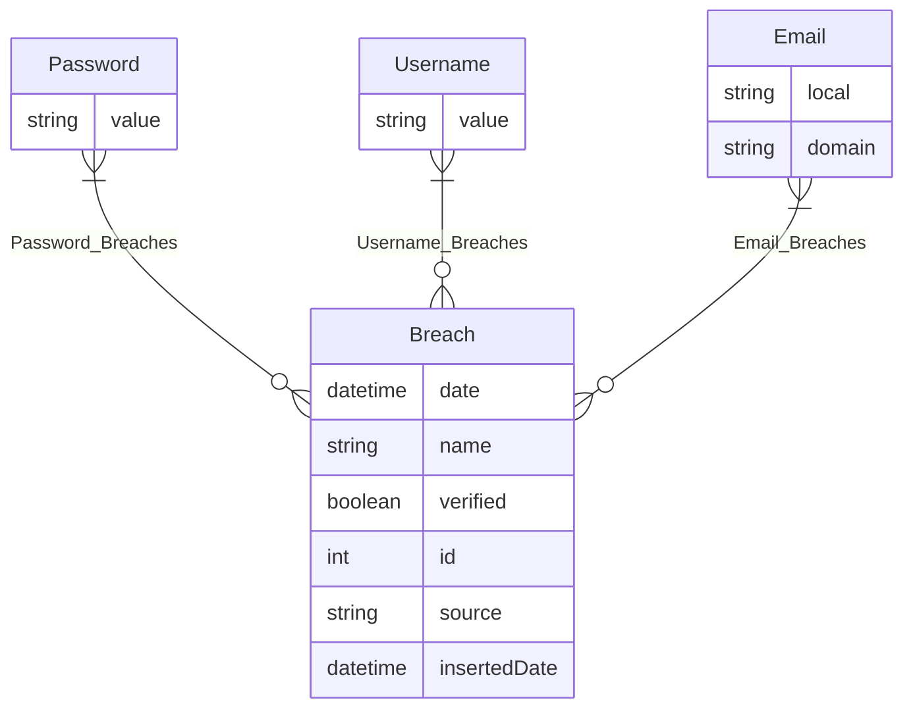

# Datagen
For development purposes we created a synthetic dataset.
This was done in python using the faker package which allows the creation of random names, usernames, emails, business etc.

With the general idea of what data we *should* have we implemented our database design.

# Database design

